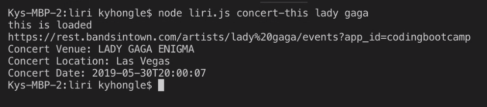
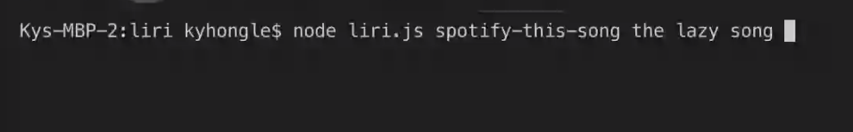
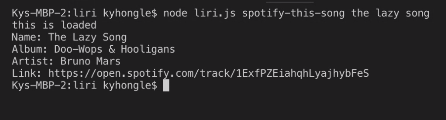
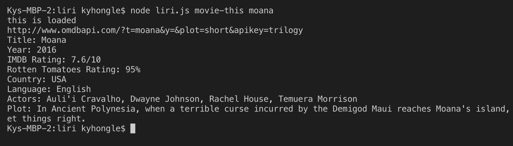

# LIRI

Liri is a search app that can be use through node.js and the app allows user to search for songs, concert, and movies with specific command lines.

How the app works is we send user commands as query to the appropriate API databases and therefore get back the data that Liri believes the user needs.

## to search for a concert

The command for this step is: node liri.js concert-this artist name

- then you hit enter
  

This will print the concert name, concert location, and the date.

## to search for a song

hit enter

This will print the name of the song, the album name, the artists, and a link to spotify.

## to search for a movie

hit enter

This will print the title of the movie, the year released, IMDB and Rotten Tomatoes ratings, country it produces, language, actors, and the general plot.

### Difficulties

For the last part of the liri app, I have yet to figure out how to run the command from the file random.txt.
