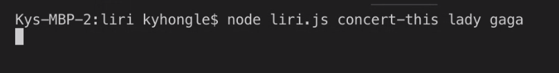

# liri

Liri is a search app that can be use through node.js and the app allows user to search for songs, concert, and movies with specific command lines.

# to search for a concert

The command for this step is: node liri.js concert-this artist name

